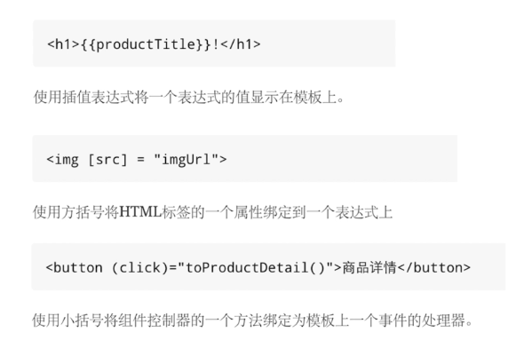

## 数据绑定



### dom属性和html属性

```
<input type="text" value="Tom" (input)="doOnInput($event)">

doOnInput(event: any) {
    //这里拿的是dom属性， 是随时变的
    console.log(event.target.value);
    //这里拿的是html属性 它的值不变是初始的值，html的值不能改变
    console.log(event.target.getAttribute('value'),111);
}

<!--disabled属性不管设计什么值都会是禁止点击，但是可以通过设置dom属性来开启或禁止 -->
<button disabled>点我</button>

```

#### dom属性和html属性的关系
- 少量HTML属性和DOM属性之间有着1:1的映射，如id
- 有些HTML属性没有对应的DOM属性，如colspan
- 有些DOM属性没有对应的HTML属性，如textContent
- 就是名字相同，HTML属性和DOM属性也不是同一样东西
- HTML属性的值指定了初始值，DOM属性的值表示当前值
- DOM属性的值可以改变，HTML属性的值不能改变
- 模板绑定是通过DOM属性和事件来工作的，而不是HTML属性

#### HTML属性绑定
- 基本HTML属性绑定
<td [attr.colspan]="tableColspan">Something</td>
- css类绑定
1.  <div class="aaa bbb" [class]="someExpression">Something</div>,这个表达式的值会完全替换掉calss里的值
2.  <div [class.special]="isSpecial">Something</div>，这个则不会
3.  <div [ngClass]="{aa: isA, bb: isB}">Something</div>
- 样式绑定
1.  <button [style.color]="isSpecial ? 'red' : 'green'">Red</button>
