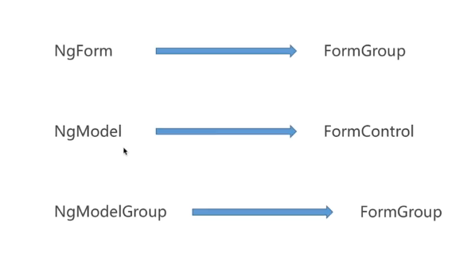
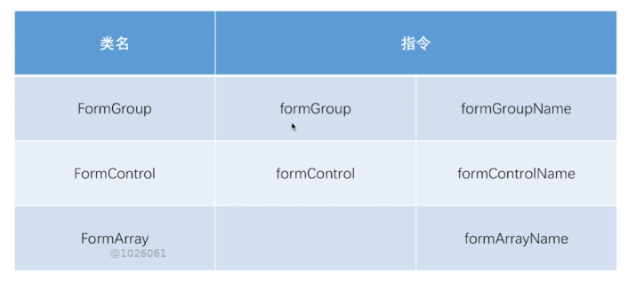
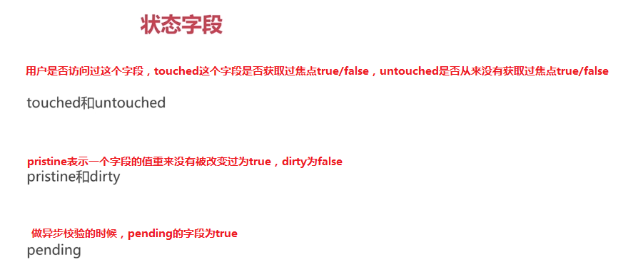

# 表单
## 纯HTML表单
1. 显示表单项
2. 校验用户输入
3. 提交表单数据

## 表单类型


## 模块的引入
import {FormsModule, ReactiveFormsModule} from "@angular/forms";
模板式表单需要引入FormsModule，响应式表单需要引入ReactiveFormsModule

## 模板式表单
### 模板式表单指令


模板式表单会自动在form添加ngForm，接管表单处理，对于有ngModel指令的会添加到表单数据模型中,会阻止表单的自动提交，如果不想angular接管表单处理可以在form表单上写ngNoForm指令，可以用div来替换form前提是需要加ngForm指令<div ngForm></div>。

ngForm指令可以被一个模板本地变量引用，以便在模板中访问ngForm的实例如： #myForm="ngForm"可以通过myForm来访问ngForm属性,myForm.value存的是所有的数据，在form标签外或者下面可以使用本地变量的值

单独给input也可以用一个本地变量
<div>用户名：<input #myNickName="ngModel" ngModel name="nickname" type="text" required pattern="[a-z0-9A-Z]"></div>
访问myNickName.value即可

给ngForm里增加json,ngModelGroup会把他包含的值放到这个josn里形成一组值


```
<!--<form #myForm="ngForm" (ngSubmit)="createUser(myForm.value, myForm.valid)" novalidate>-->
<form #myForm="ngForm" (ngSubmit)="createUser(myForm.value, myForm.valid)">
  <div>
    用户名：<input ngModel required minlength="6" name="nickname" type="text">
    <div [hidden]="!myForm.form.hasError('required', 'nickname')">用户名是必填项</div>
    <div [hidden]="!myForm.form.hasError('minlength', 'nickname')">用户名的最少长度</div>
  </div>
  <div>
    手机号：<input ngModel mobile name="mobile" type="number" (input)="onMobileInput(myForm)">
    <div [hidden]="mobileValid || mobilePristine">
      <div [hidden]="!myForm.form.hasError('mobile', 'mobile')">手机号不合法</div>
    </div>
  </div>
  <div ngModelGroup="passwordInfo" password>
    <div>密码：<input required type="password" ngModel name="password"></div>
    <div [hidden]="!myForm.form.hasError('required', 'passwordInfo.password')">密码是必填项</div>
    <div>确认密码：<input ngModel name="passwordConfirm" type="password"></div>

    <div [hidden]="!myForm.form.hasError('password', 'passwordInfo')">{{myForm.form.getError('password', 'passwordInfo')?.description}}</div>
  </div>
  <button type="submit">注册</button>
</form>

<!-- novalidate 是让angular指定的校验器去做校验,不用浏览器默认的属性去做校验-->
```
- 实现数据的双向绑定，只要在input标签上加上ngModel，不用给属性值，给name赋上属性值即可
- angular禁止了form的自动提交，因为是单页应用，所以它提供了ngSubmit事件

## 响应式表单
### 响应式表单指令


```
//模板

<form [formGroup]="formModel" (ngSubmit)="createUser()">
  <div>用户名：<input formControlName="nickname" type="text"></div>
  <div>邮箱：
    <ul formArrayName="emails">
      <li *ngFor="let email of formModel.get('emails').controls; let i = index;">
        <input [formControlName]="i" type="email">
      </li>
    </ul>
    <button type="button" (click)="addEmail()">增加Email</button>
  </div>
  <div>手机号：<input formControlName="mobile" type="number"></div>
  <div formGroupName="passwordInfo">
    <div>密码：<input formControlName="password" type="password"></div>
    <div>确认密码：<input formControlName="passwordConfirm" type="password"></div>
  </div>
  <button type="submit">注册</button>
</form>


//组件
import { Component, OnInit } from '@angular/core';
import {FormArray, FormControl, FormGroup} from "@angular/forms";

@Component({
  selector: 'app-reactived-form',
  templateUrl: './reactived-form.component.html',
  styleUrls: ['./reactived-form.component.css']
})
export class ReactivedFormComponent implements OnInit {

  private formModel: FormGroup;//包含一组值，里面可以包含FormControl和FormArray，每一个input都用一个FormControl来控制，FromArray表示的是数组

  constructor() {
    this.formModel = new FormGroup({
      nickname: new FormControl(),
      mobile: new FormControl(),
      emails: new FormArray([
        new FormControl()
      ]),
      passwordInfo: new FormGroup({
        password: new FormControl(),
        passwordConfirm: new FormControl()
      })
    })
  }

  ngOnInit() {
  }

  createUser() {
    console.log(this.formModel.value);
  }

  addEmail() {
    //拿出来的时候是没有类型，需要用as强转成FormArray
    let emails = this.formModel.get('emails') as FormArray;
    emails.push(new FormControl());
  }

}

```
## formbuild是angular提供的一个工具类，它简化了定义响应式表单数据的语法

## 表单校验字段


