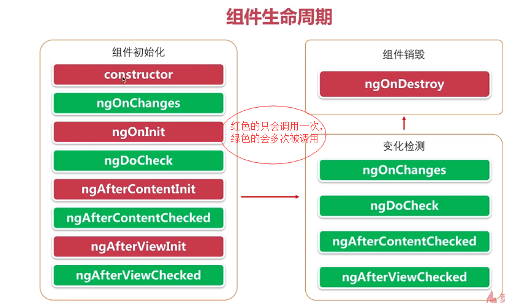
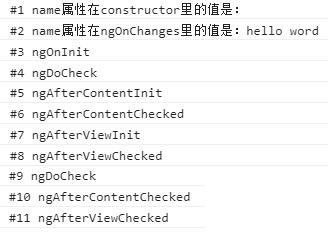

# 生命周期


## 生命周期调用顺序


```
import {
  AfterContentChecked, AfterContentInit, AfterViewChecked, AfterViewInit, Component, DoCheck, Input, OnChanges,
  OnDestroy,
  OnInit, SimpleChanges
} from '@angular/core';

let logIndex:number = 1;

@Component({
  selector: 'app-lift',
  templateUrl: './lift.component.html',
  styleUrls: ['./lift.component.css']
})
export class LiftComponent implements OnInit, OnChanges, DoCheck, AfterViewChecked, AfterContentChecked, AfterViewInit, AfterContentInit, OnDestroy {

  @Input()
  name: string = 'Tom';
  logIte(msg: string) {
    console.log(`#${logIndex++} ${msg}`);
  }

  //输入属性在这个方法里是没有被赋值的，如果要用到这个可以在ngOnInit里用
  constructor() {
    this.logIte('name属性在constructor里的值是：'+name);
  }

  //当一个父组件初始化一个或者改变一个子组件的输入属性的时候被调用，如果这个组件没有输入属性，则这个方法永远不会被调用，它的首次调用一定发生在ngOnInit之前
  ngOnChanges(changes: SimpleChanges): void {
    let name = changes['name'].currentValue;
    this.logIte('name属性在ngOnChanges里的值是：'+name);
  }

  ngOnInit() {
    this.logIte('ngOnInit');
  }

  //用来检测的，在angular每个变更周期中调用的
  ngDoCheck(): void {
    this.logIte('ngDoCheck');
  }

  //下面两个是跟内容投影相关
  ngAfterContentInit(): void {
    this.logIte('ngAfterContentInit');
  }

  ngAfterContentChecked(): void {
    this.logIte('ngAfterContentChecked');
  }

  //下面跟模板和检查相关
  ngAfterViewInit(): void {
    this.logIte('ngAfterViewInit');
  }

  ngAfterViewChecked(): void {
    this.logIte('ngAfterViewChecked');
  }

  ngOnDestroy(): void {
    this.logIte('ngOnDestroy');
  }

}

```


```
import {Component, DoCheck, Input, OnChanges, OnInit, SimpleChanges} from '@angular/core';

@Component({
  selector: 'app-child',
  templateUrl: './child.component.html',
  styleUrls: ['./child.component.css']
})
export class ChildComponent implements OnInit, OnChanges, DoCheck {

  @Input()
  stockName: string;

  @Input()
  stock: {name: string};

  message: string = '初始化消息';
  oldStockName: string;
  changeDetected: boolean;
  changeCount: number = 0;

  constructor() { }

  ngOnInit() {
  }

  //可变对象，不可变对象。不可变对象是在内存中被创建后，他的值永远不可改变，如字符串，当字符变量被赋值时，只是变量从一个内存地址指向了另一个内存地址。对象是可变对象
  //初始化时不管是可变或不可变的输入属性都会调用ngOnChanges,但是当父组件的可变对象里的值发生变化时，是不会再触发此函数，不可变对象是可以触发的，但是子组件的值是发生了变化是因为变更检测机制的原因
  ngOnChanges(changes: SimpleChanges): void {
    console.log(JSON.stringify(changes,null,2))
  }

  //触发事件也会调用，会被很多触发调用，所以如果要对某一个元素做处理，最好判断一下，
  ngDoCheck(): void {
      if(this.stock.name !== this.oldStockName) {
        this.changeDetected = true;
        console.log('DoCheck:stock.name从'+this.oldStockName+'变为'+this.stock.name);
        this.oldStockName = this.stock.name;
      }

      if(this.changeDetected) {
        this.changeCount = 0;
      }else {
        ++this.changeCount;
        console.log('DoCheck:stock.name 没变化时，ngDoCheck方法被调用了'+this.changeCount+'次')
      }

      this.changeDetected = false;
  }
  
}

```
