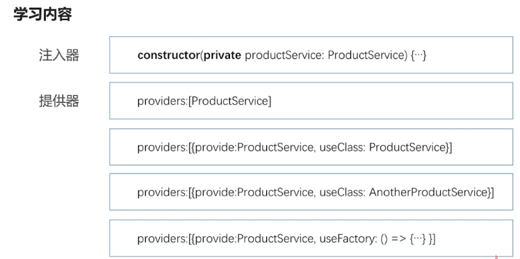

# 依赖注入
## 学习的内容
1. 什么是依赖注入模式及使用依赖注入的好处
2. 介绍Angular的依赖注入实现：注入器和提供器
3. 注入器的层级关系

## 依赖注入的好处


## 注入器和提供器


```
import { Injectable } from '@angular/core';
import {StockService, Stock} from "./stock.service";
import {LoggerService} from "./logger.service";

//因为要实现同一个tocken的注入所以要写成如下,也要有StockService,并把方法和属性也copy过来，StockService如果注入了其他服务，因为是同一个tocken，所以这里也需要注入LoggerService,否则会报错
@Injectable()
export class AnotherStockService implements StockService{
  getStock(): Stock {
      return new Stock(2, "微软");
  }

  constructor(public logger: LoggerService) { }

}

```

```
import { Component, OnInit, Injector } from '@angular/core';
import {StockService, Stock} from "../shared/stock.service";
import {AnotherStockService} from "../shared/another-stock.service";

@Component({
  selector: 'app-stock2',
  templateUrl: './stock2.component.html',
  styleUrls: ['./stock2.component.css'],
  providers: [{provide: StockService, useClass: AnotherStockService}]
})
export class Stock2Component implements OnInit {
  private stock: Stock;

    constructor(public stockService: StockService) { }
    //注入的第二种方式，把注入器引进来，注入器再请求他需要的服务
 /*   public stockService: StockService;
    constructor(public injector: Injector) {
      this.stockService = injector.get(StockService);
  }*/

  ngOnInit() {
    this.stock = this.stockService.getStock();
  }

}

```

### 工厂提供器

```
//解决工厂传递里new 服务的耦合用deps，是要依赖的服务，通过参数传给工厂
{provide: StockService, useFactory: (logger: LoggerService, isDev) => {
  if(isDev) {
    return new StockService(logger);
  }else {
    return new AnotherStockService(logger);
  }
}, deps: [LoggerService, "IS_DEV_ENV"]},
LoggerService,

//4.变量的提供器
// {provide: "IS_DEV_ENV", useValue: false}
{provide: "IS_DEV_ENV", useValue: {isDev: true}}
```


