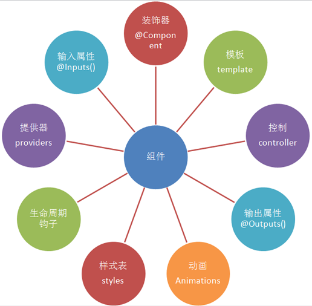

## angular-cli
[angular-cli网址](https://github.com/angular/angular-cli)

参考资料：
- [https://segmentfault.com/a/1190000009771946](https://segmentfault.com/a/1190000009771946)
- [https://segmentfault.com/a/1190000008623106](https://segmentfault.com/a/1190000008623106)

## 工具
VSCode配置：

Debug + Angular 2 + Snippets

Debugger for Chrome使VSC可以Debug Angular应用

Chrome配置：安装Augury创建

安装chrome插件打开https://chrome-extension-downloader.com/，输入id：elgalmkoelokbchhkhacckoklkejnhcd，下载下来，再把该插件拖到chrome://extensions/里即可

## 常用命令

- ng new 项目名：新建angular项目
- ng bulid -prod:生产环境编译 
- ng serve -o: 启动开发服务器，并开启浏览器访问
- ng new taskmgr -si --style=scss
- 创建模块：ng g m core
- 创建组件：ng g c core/header --spec=false
- ng new router --routing,会自动生成一个app-routing.module.ts并对其进行导入和基础配置
- 访问路径：http://localhost:4200/

## Mock Rest API

- json-server：用于快速搭建REST API的利器
1. 安装：npm install -g json-server
2. 使用：输入json-server ./mock/data.json 后面是对应json文件的地址，启动后访问http://localhost:3000
- https://www.getpostman.com/，下载postman安装，填了数据后会自动更新访问的json文件
- 还可以用VSCode的REST Client插件

## ajax未请求数据过来时，页面模板定义的数据会报错解决方法：
1. 路由守卫：Resolve时获取数据

## 安装过程中遇到问题

先uninstall，再清缓存npm cache verify，再安装

## angular-组件库

- Material: https://material.io/components/
  安装带版本的：cnpm i --save @angular/material@2.0.0-beta.7
  图标：https://material.io/icons/

- AdminLTE：https://github.com/almasaeed2010/AdminLTE，基于bootstrap3的后台管理模板

    npm install admin-lte --save

## angular.json

```
{
  "project": {
    "name": "ng-admin", //项目名称
    "ejected": false // 标记该应用是否已经执行过eject命令把webpack配置释放出来
  },
  "apps": [
    {
      "root": "src", // 源码根目录
      "outDir": "dist", // 编译后的输出目录，默认是dist/
      "assets": [ // 记录资源文件夹，构建时复制到`outDir`指定的目录,静态服务器的配置，如果想要一个目录变成静态文件可在此处加入，然后访问如：http://localhost:4200/assets/gifts.svg
        "assets",
        "favicon.ico"
      ],
      "index": "index.html", // 指定首页文件，默认值是"index.html"
      "main": "main.ts", // 指定应用的入门文件
      "polyfills": "polyfills.ts", // 指定polyfill文件
      "test": "test.ts", // 指定测试入门文件
      "tsconfig": "tsconfig.app.json", // 指定tsconfig文件
      "testTsconfig": "tsconfig.spec.json", // 指定TypeScript单测脚本的tsconfig文件
      "tsconfig":"tsconfig.app.json",
      "prefix": "app", // 使用`ng generate`命令时，自动为selector元数据的值添加的前缀名
      "deployUrl": "//cdn.com.cn", // 指定站点的部署地址，该值最终会赋给webpack的output.publicPath，常用于CDN部署
      "styles": [ // 引入全局样式，构建时会打包进来，常用于第三方库引入的样式
        "styles.css"
      ],
      "scripts": [ // 引入全局脚本，构建时会打包进来，常用语第三方库引入的脚本
      ],
      "environmentSource": "environments/environment.ts", // 基础环境配置
      "environments": { // 子环境配置文件
        "dev": "environments/environment.ts",
        "prod": "environments/environment.prod.ts"
      }
    }
  ],
  "e2e": {
    "protractor": {
      "config": "./protractor.conf.js"
    }
  },
  "lint": [
    {
      "project": "src/tsconfig.app.json"
    },
    {
      "project": "src/tsconfig.spec.json"
    },
    {
      "project": "e2e/tsconfig.e2e.json"
    }
  ],
  "test": {
    "karma": {
      "config": "./karma.conf.js"
    }
  },
  "defaults": { // 执行`ng generate`命令时的一些默认值
    "styleExt": "scss", // 默认生成的样式文件后缀名
    "component": {
      "flat": false, // 生成组件时是否新建文件夹包装组件文件，默认为false（即新建文件夹）
      "spec": true, // 是否生成spec文件，默认为true
      "inlineStyle": false, // 新建时是否使用内联样式，默认为false
      "inlineTemplate": false, // 新建时是否使用内联模板，默认为false
      "viewEncapsulation": "Emulated", // 指定生成的组件的元数据viewEncapsulation的默认值
      "changeDetection": "OnPush" // 指定生成的组件的元数据changeDetection的默认值
    }
  }
}
```

## 框架


## 组件




## 字符格式
- public attr: string
- public attr: boolean[]
- private stocks: Array<Stock>

## 错误

- 需要引入http：HeaderComponent.html:5 ERROR Error: Could not find Http provider for use with Angular Material icons. Please include the HttpModule from @angular/http in your app imports.

## 问题

1. 如何实现有webpack的功能，代码分割，按需加载。
2. 服务端渲染
3. 单页SEO优化

