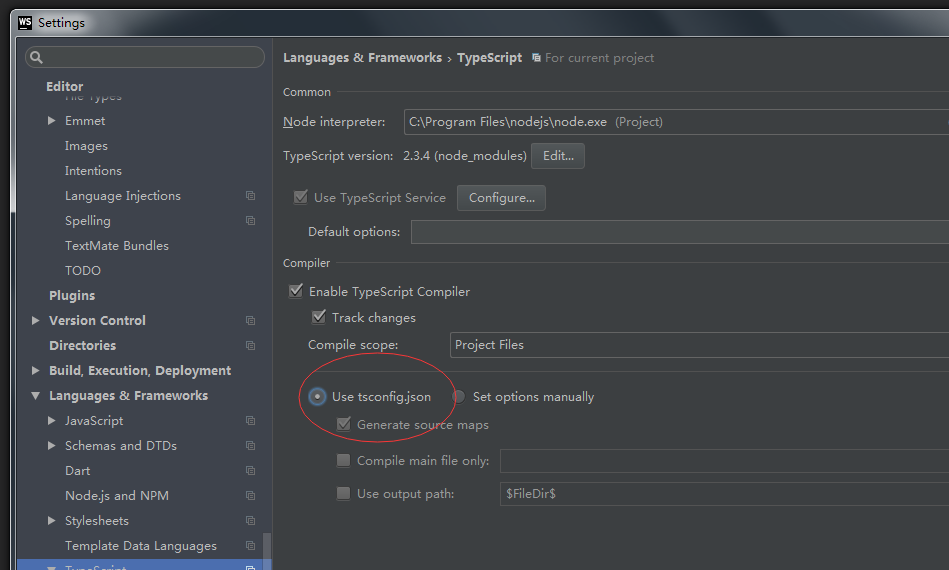

# 与服务器通讯
- 创建web服务器
- Http通讯
- WebSocket通讯

## 创建web服务器
- 使用Nodejs创建服务器
- 使用Express创建restful的http服务
- 监控服务器文件的变化

npm init -y 建立默认配置的package.json文件

npm i @types/node --save，我们用typescript来开发所以需要引用node的类型定义文件

node本身是不认typescript的，所以需要用tsconfig.json来编译文件

需要配置webstrom 的 设置



```
/**
 *  npm i @types/express --save    文件支持typescript
 *  npm i @types/node --save     node支持typescript语法
 *  npm init -y 创建一个默认的package.json文件
 *  npm i @types/ws --save  websocket支持typescript
 *  需要创建tsconfig.json来编译typescript
 * */
```
