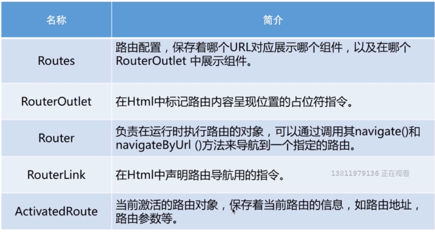
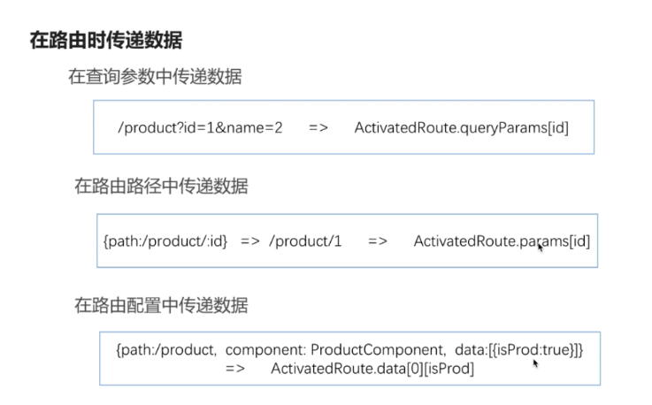
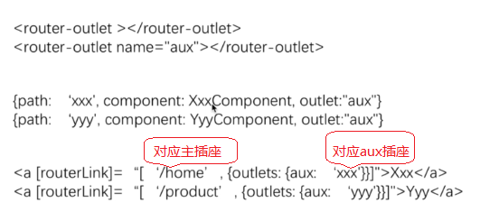
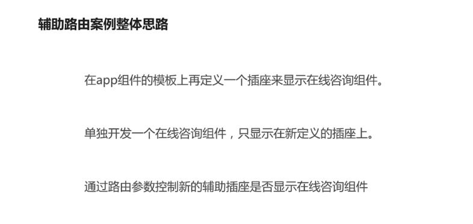
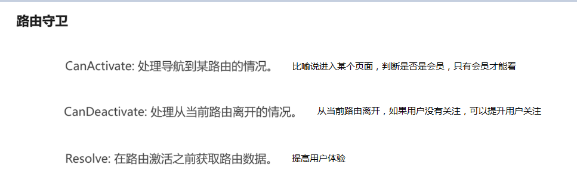

## 学习的主要内容
1. 了解路由的基础知识
2. 子路由、路由参数、辅助路由、路由守卫
3. 如何添加路由

## 路由基础
命令：ng new router --routing,会自动生成一个app-routing.module.ts并对其进行导入和基础配置



- 配置路由模块
- 引入插座<router-outlet></router-outlet>
- routerLink

## 路由参数


## 辅助路由
用于类似侧导航的咨询等相关位置功能，很多页面都有




## 路由守卫
所谓的路由守卫其实就是拦截器，在进入路由和离开路由去执行一些逻辑。

在一个组件里如：private stock: Stock;//如果这只是ajax请求过来的数据，一开始没值，会报错，所以用路由守卫里的Resolve来提交获取数据



## 路由事件
在别的组件里要判断当前路由所相关的事情，可以用路由事件，具体可参数angular-auction

```
import { Component, OnInit } from '@angular/core';
import { Router, NavigationEnd } from '@angular/router';
import 'rxjs/add/operator/filter';

@Component({
  selector: 'app-content',
  templateUrl: './content.component.html',
  styleUrls: ['./content.component.css']
})
export class ContentComponent implements OnInit {
  pageTitle: string = '';
  pageDesc: string = '';

  constructor(public router: Router) {
    router.events
      .filter(event => event instanceof NavigationEnd)//选择路由结束事件
      .subscribe((event: NavigationEnd) => {
          if(event.url == '/dashboard') {
            this.pageTitle = '这是首页';
            this.pageDesc = '';
          }else {
            this.pageTitle = '股票信息管理';
            this.pageDesc = '进行股票信息基本增删改查';
          }
      })
  }
  ngOnInit() {}
}

```

